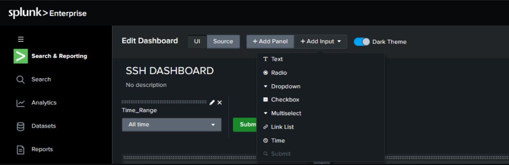
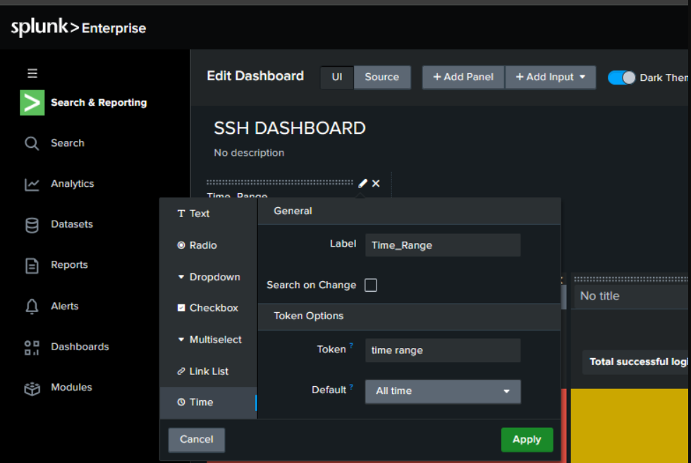
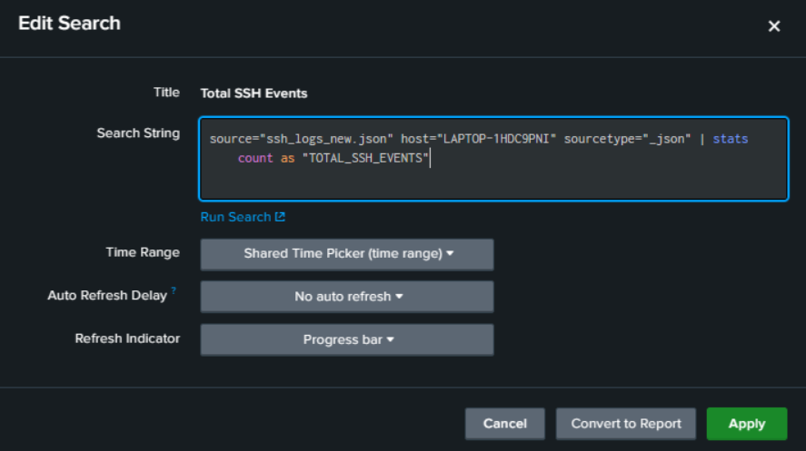
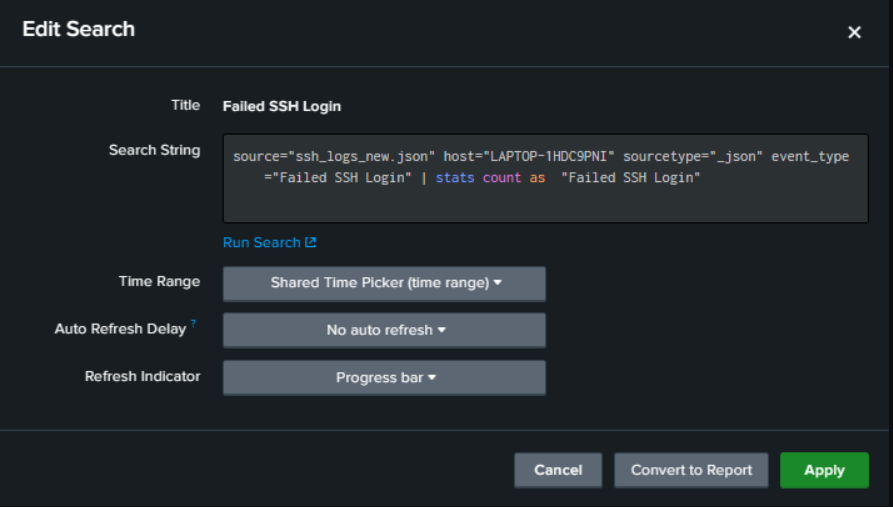
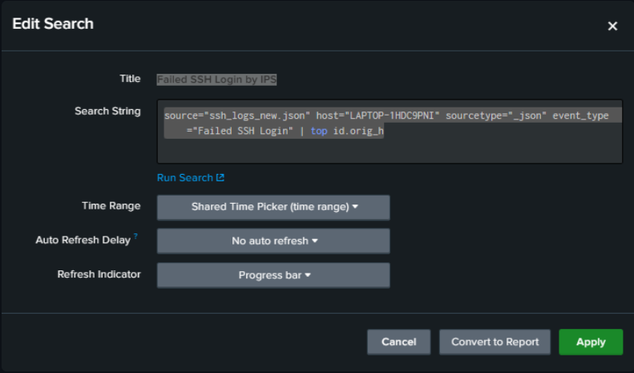
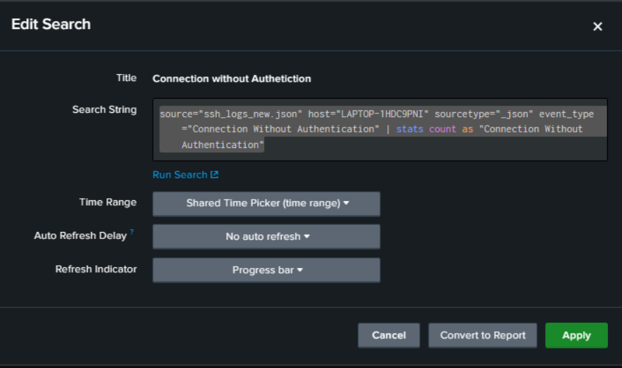
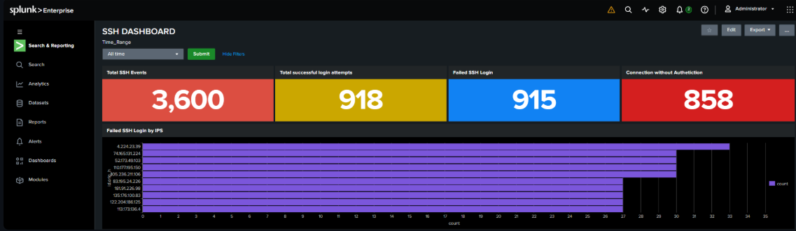

# SSH Security Dashboard (Splunk)

A Splunk dashboard built to monitor and analyze SSH login activity from JSON-formatted logs — designed for quick visibility into successful logins, failed login attempts, unauthenticated connections, and the source IPs behind repeated failures. Built as a SOC-style monitoring use case for detecting brute-force / suspicious SSH activity.

## 🎯 Purpose

SSH is one of the most commonly targeted services for brute-force and unauthorized access attempts. This dashboard gives a single-pane view of:

- Overall SSH traffic volume
- Login success vs. failure ratio
- Top offending IPs attempting failed logins
- Connections established without proper authentication

This kind of dashboard is typically used in a **SOC (Security Operations Center)** environment for real-time monitoring and can be extended into alerting workflows.

## 🗂️ Data Source

- **Source file:** `ssh_logs_new.json`
- **Sourcetype:** `_json`
- **Host:** `LAPTOP-1HDC9PNI`
- Logs contain fields like `event_type` (e.g., *Successful SSH Login*, *Failed SSH Login*, *Connection Without Authentication*) and `id.orig_h` (origin IP of the connection).

## ⏱️ Dashboard Input

- **Time_Range** — a shared time-range picker (token: `time_range`, default: *All time*) applied across all panels via **Shared Time Picker (time range)**, so changing it updates every panel at once.

## 📊 Dashboard Panels & SPL Queries

**1. Total SSH Events** — Total count of all SSH-related events ingested.
```spl
source="ssh_logs_new.json" host="LAPTOP-1HDC9PNI" sourcetype="_json" | stats count as "TOTAL_SSH_EVENTS"
```

**2. Total Successful Login Attempts** — Count of events where SSH login succeeded.
```spl
source="ssh_logs_new.json" host="LAPTOP-1HDC9PNI" sourcetype="_json" event_type="Successful SSH Login" | stats count as "Total_SSH_LOGINS"
```

**3. Failed SSH Login** — Count of failed login attempts.
```spl
source="ssh_logs_new.json" host="LAPTOP-1HDC9PNI" sourcetype="_json" event_type="Failed SSH Login" | stats count as "Failed SSH Login"
```

**4. Failed SSH Login by IPs** — Top source IPs generating failed login attempts (bar chart).
```spl
source="ssh_logs_new.json" host="LAPTOP-1HDC9PNI" sourcetype="_json" event_type="Failed SSH Login" | top id.orig_h
```

**5. Connection Without Authentication** — Count of connections established without any authentication.
```spl
source="ssh_logs_new.json" host="LAPTOP-1HDC9PNI" sourcetype="_json" event_type="Connection Without Authentication" | stats count as "Connection Without Authentication"
```

## 🚀 How to Reproduce

1. Ingest your SSH log file (`ssh_logs_new.json`) into Splunk as sourcetype `_json`.
2. Create a new dashboard → **SSH DASHBOARD**.
3. Add a **Time** input (`Time_Range`) with token `time_range`, default *All time*.
4. Add each panel above using the corresponding SPL query, and set each panel's **Time Range** to **Shared Time Picker (time range)**.
5. Save and switch to view mode to see the final dashboard.

## 🔧 Tech Stack

- **Splunk Enterprise** (Search & Reporting, Dashboard Studio / Classic UI)
- **SPL (Search Processing Language)**
- JSON-based log ingestion

## 📌 Future Improvements

- Add alerting for failed-login spikes from a single IP (potential brute-force detection)
- Geo-IP mapping for failed login source IPs
- Add a trend/timeline panel to visualize login attempts over time
- Correlate failed logins with successful ones from the same IP (possible successful brute-force)

---

## 🖼️ Screenshots

### 1. Edit Dashboard — Add Input Menu
Configuring dashboard inputs (Text, Radio, Dropdown, Time, etc.) while building the dashboard.



### 2. Time Range Input Configuration
Setting up the shared time-range token (`time_range`) with default value *All time*.


### 3. Total SSH Events — Search Configuration
SPL query counting all ingested SSH events.



### 4. Successful SSH Login — Search Configuration
SPL query counting successful SSH login attempts.


### 5. Failed SSH Login — Search Configuration
SPL query counting failed SSH login attempts.



### 6. Failed SSH Login by IP — Search Configuration
SPL query listing top source IPs by failed login count.



### 7. Connection Without Authentication — Search Configuration
SPL query counting connections with no authentication.



### 8. Final Dashboard View
The completed SSH Security Dashboard with all panels live.



---
*Built as part of hands-on SOC / cybersecurity monitoring practice.*
